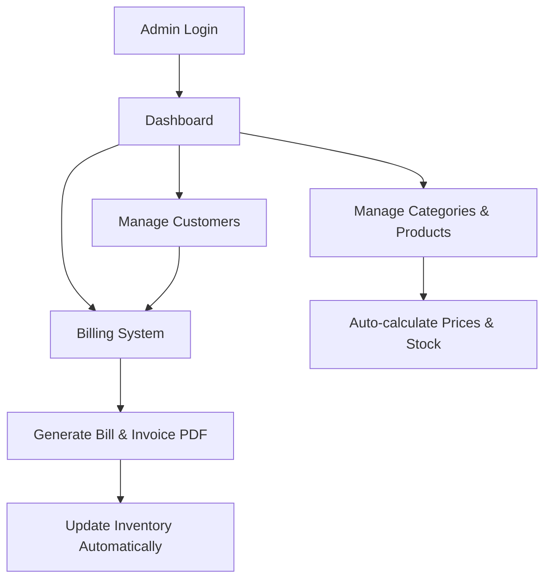

# 🛒 Grocery Management System

Welcome to the **Grocery Management System**! This is a complete, production-ready, full-stack Java application built with Spring Boot, Thymeleaf, Hibernate, and a normalized database. It handles admin authentication, dynamic product cataloging, inventory tracking, bill generation, and customer management.

This README is structured specifically to help developers understand the architecture and prepare for technical interviews.

---

## 1. 📊 Project Flow Diagram



---

## 2. 🔄 Detailed Project Flow (Step-by-Step)

1. **Admin Logs In**: The system uses Spring Security to authenticate the admin using encrypted credentials.
2. **Product Management**: The admin categorizes and adds products, providing the Cost Price, MRP, Selling Price, and Discount.
3. **Auto Calculation & Storage**: The system automatically calculates the `Final Price` dynamically based on the Selling Price and Discount, storing the product and updating the current inventory count.
4. **Customer Management**: Walk-in or registered customers are managed in the system with their contact details.
5. **Billing & Checkout**: The admin selects products from the inventory and quantities for a customer's bill.
6. **Validation & Finalization**: The system validates if sufficient stock exists. If valid, the final total is calculated.
7. **Inventory Auto-Update**: Once the bill is successfully generated, the purchased product quantities are automatically deducted from the main inventory.
8. **Invoice Generation**: A PDF invoice/receipt is generated instantly for the customer.

---

## 3. ⚙️ Technologies Used (Explain WHY)

* **Java & Spring Boot**: Chosen for its robust enterprise-level ecosystem, built-in dependency injection, and rapid application setup without heavy XML configuration. It provides built-in embedded servers (Tomcat).
* **Spring Data JPA / Hibernate**: Used as the ORM (Object Relational Mapper) to eliminate boilerplate SQL code, allowing seamless interaction with the database using Java objects.
* **H2 Database / MySQL**: Embedded H2 is used for zero-setup local development, allowing the app to run instantly on any machine. MySQL is easily swappable for production deployments.
* **Thymeleaf**: A modern server-side Java template engine capable of rendering HTML dynamically. Used over JSP because it aligns perfectly with Spring Boot and allows templates to be viewed as static prototypes directly in browsers.
* **Spring Security**: Secures the application to ensure only authenticated administrators can access the dashboard and perform operations.
* **Bootstrap 5**: Provides a clean, responsive, and mobile-friendly UI out-of-the-box without writing complex custom CSS.

---

## 4. 🚧 Challenges Faced & Solutions

* **Handling Price Calculation Logic**:
  * *Problem*: Calculating the final price manually every time a product is displayed is inefficient.
  * *Solution*: Implemented JPA Entity Lifecycle Hooks (`@PrePersist` and `@PreUpdate`) to auto-calculate the `finalPrice` based on `sellingPrice` and `discount` before the entity is saved to the database.
* **Maintaining Data Consistency in Billing + Inventory**:
  * *Problem*: If a bill throws an error halfway through generation, inventory might still be deducted incorrectly.
  * *Solution*: Utilized Spring's `@Transactional` annotations on the `BillingService`. This ensures that creating the bill, adding bill items, and reducing stock all happen in a single transaction. If any step fails, the entire process rolls back.
* **Handling Insufficient Stock**:
  * *Problem*: Users attempting to bill more items than are available in stock caused unhandled 500 Server Errors.
  * *Solution*: Implemented robust exception handling in the Controller to catch `DataIntegrityViolationException` and `RuntimeException`, safely redirecting the user back to the form with a friendly UI flash message.
* **Designing Proper Database Relationships**:
  * *Problem*: Deleting a category or product that is referenced in historical bills threw constraint errors.
  * *Solution*: Configured strict Hibernate `@OnDelete(action = OnDeleteAction.CASCADE)` rules so that referenced dependencies are handled cleanly at the database level when absolute forced deletion is necessary.

---

## 5. 💡 Key Features (Highlight for Interview)

* **Real-world pricing system**: Strict tracking of Cost Price, MRP, Selling Price, and Discount rules.
* **Auto-calculated Final Price**: Leveraging JPA lifecycle events to keep business logic centralized.
* **Secure transactions**: Centralized Billing system with relational mapping to Customers and Products.
* **Inventory auto-update**: Atomic stock reduction executed strictly upon successful checkout.
* **Exception Handling**: Graceful error capturing in MVC controllers with front-end Thymeleaf Flash Alerts.
* **Clean Architecture**: Strong boundary separation between Controllers (Routing), Services (Business Logic), and Repositories (Data Access).

---

## 6. 🧠 Important Concepts for Interview

* **MVC Architecture**: The project strictly follows Model (Entities + DB), View (Thymeleaf HTML templates), and Controller (Spring `@Controller`).
* **JPA/Hibernate**: The concept of ORM, `@Entity`, `@OneToMany`/`@ManyToOne` relationships, and Cascade rules.
* **Dependency Injection (DI)**: How Spring's IoC container builds and injects beans (e.g., using Lombok's `@RequiredArgsConstructor` for constructor injection).
* **Spring Security**: Implementing custom `UserDetailsService`, `SecurityFilterChain`, and password hashing using `BCryptPasswordEncoder`.
* **Database Normalization**: Separating entities cleanly (e.g., `Bill` header vs `BillItem` details) to prevent data redundancy.
* **Transactional Integrity**: The ACID properties provided by `@Transactional` during complex operations like billing.

---

## 7. ▶️ How to Run Project

### Backend & Database Setup
1. **Prerequisites**: Ensure you have Java 17+ installed. No external database software like MySQL is required natively because the app is configured to use an embedded H2 database for instant, zero-setup execution.
2. **Clone/Open Project**: Open the project folder in your terminal.
3. **Run the Application**:
   Execute the Maven Wrapper to compile and boot up the server:
   ```bash
   # On Windows
   .\mvnw.cmd spring-boot:run

   # On Mac/Linux
   ./mvnw spring-boot:run
   ```
4. **Access the App**:
   * Open your browser and navigate to: [http://localhost:8080](http://localhost:8080)
   * A default admin user is seeded into the database automatically. Login using the default credentials (`admin` / `admin123`).
   * *Optional*: You can view the raw database tables by navigating to `http://localhost:8080/h2-console` (JDBC URL: `jdbc:h2:mem:grocery_db`, Username: `sa`, Password: *[Empty]*).

---

## 8. 🔥 Key Highlights (Quick Revision Section)

* **Architecture**: Spring Boot MVC + Thymeleaf server-side rendering.
* **Database**: Hibernate/JPA ORM with embedded H2 (or MySQL) utilizing `@ManyToOne` relationships.
* **Security**: Session-based Spring Security with BCrypt hashed passwords.
* **Transaction Management**: Used `@Transactional` during billing to ensure atomicity (Bill + Bill Items + Stock Deduction).
* **JPA Lifecycles**: `@PrePersist`/`@PreUpdate` heavily used for auto-calculations.
* **Database Constraints**: Controlled deletion behavior using DB-level `@OnDelete(action = OnDeleteAction.CASCADE)`.
* **Error Handling**: Graceful Controller-level `RedirectAttributes` handling preventing 500 Internal Server crashes.
* **Clean DI**: Used Constructor Injection via Lombok's `@RequiredArgsConstructor`.


## 📜 License

This project is licensed under the MIT License.

© 2026 Sachin Tripathi & Riddhisha Srivastava
